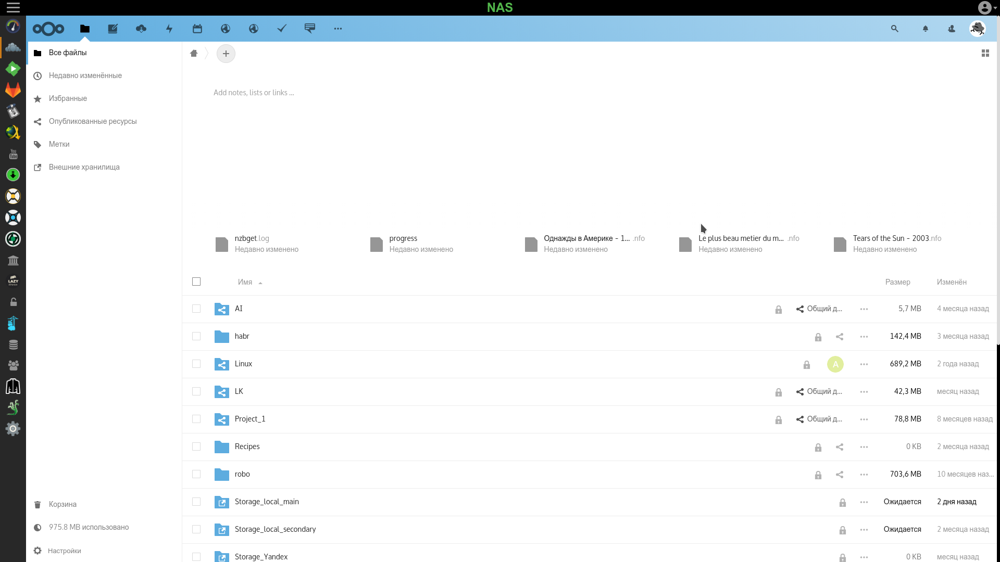
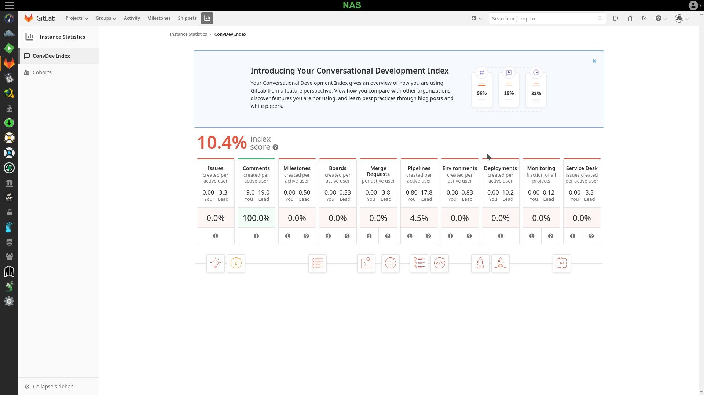
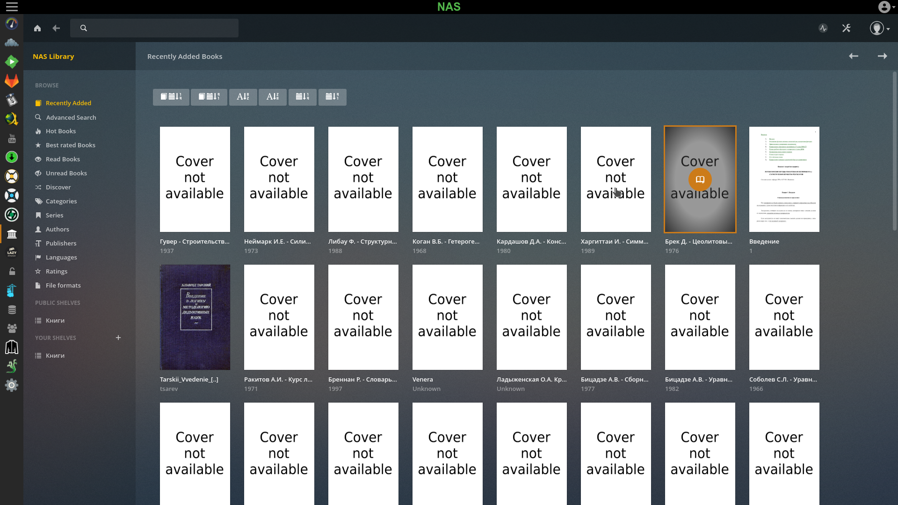
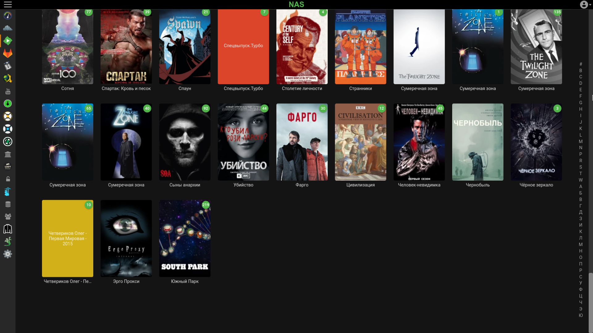

Secure NAS
==========

## What is it?

This is the complete configuration for a Linux-based multiservice secure server that you can create yourself.

## Features

- An open source solution.
- [Big hardware selection guide and "concurrents" description](docs/nc-2-need-nas/article.md). On 2018.
- [Debian-based](https://www.debian.org/index.html).
- [ZFS](https://zfsonlinux.org/) is the only filesystem that is used. Root and boot on ZFS mirror.
- Full-disk encryption with a native [LUKS](https://gitlab.com/cryptsetup/cryptsetup/blob/master/README.md).
- Protection against reboot. [Lightweight SSH server](https://matt.ucc.asn.au/dropbear/dropbear.html) integrated in initramfs. You can decrypt disks remotely.
- All services communicate with user via HTTPS, even if the service does not explicitly support HTTPS.
- HTTPS with a regular certificate signed by [Let's Encrypt](https://letsencrypt.org/).
- Certificate auto renewal.
- One certificate for all services using reverse proxy.
- Public-available services with [CloudNS](https://www.cloudns.net/).
- Docker-isolation between services and between services and host.
- Most services are well-tested and stable from [Linuxserver.io](https://www.linuxserver.io/) initiative.
- Multiuser with one authorization provider.
- LDAP as an authorization provider.
- Service can use LDAP authorization even if it doesn't support LDAP native.
- Integration between services. I.e. the media search service can use the torrent downloader to download movie.
- Some services were patched by the author for integration with others (i.e. Nextcloud was patched for use inside iframe Organizr).

And much more...

## Subsystems

### NAS control

[OpenMediaVault](https://www.openmediavault.org/) installed as a package.

### Backup

Multiagent backup service.
Implemented using [UrBackup](https://www.urbackup.org/).

### Cloud

Implemented using:

- [NextCloud](https://nextcloud.com/) as a cloud provider.
- [OnlyOffice](https://www.onlyoffice.com/) as an office suite, integrated with NextCloud.

### Download subsystem

- Searchers:
  * [Radarr](https://github.com/Radarr/Radarr) for the films.
  * [Sonarr](https://github.com/Sonarr/Sonarr) for the TV shows and series.
  * [Lidarr](https://github.com/lidarr/Lidarr) for the music.
- Downloaders:
  * [jDownloader2](https://jdownloader.org/jdownloader2) for files.
  * [NZBGet](https://nzbget.net/) for Usenet.
  * [Transmission](https://transmissionbt.com/) for torrents.
  * [Youtube-dl](https://github.com/ytdl-org/youtube-dl) with web-ui for video streams.
- Utilities:
  * [Jackett](https://github.com/Jackett/Jackett).
  * [Hydra2](https://github.com/theotherp/nzbhydra2).

### Version control system

Implemented using [GitLab](https://gitlab.com/).

### Books library

- Database with automatic synchronization, based on [patched Calibre](https://github.com/artiomn/calibre). Only console. No user interaction required.
- [Calibre-web](https://github.com/janeczku/calibre-web) as a web-interface.

This service has an independent repository [here](https://github.com/artiomn/library-docker).

### Media system

Implemented using [Emby](https://emby.media/)

### LDAP server

- [OpenLDAP Server](https://www.openldap.org/).
- [phpLDAPAdmin](http://phpldapadmin.sourceforge.net/wiki/index.php/Main_Page) as an administrative interface.
- [LDAP SSP](https://ltb-project.org/documentation/self-service-password) for the user password changing.

### Frontend

[Organizr](https://github.com/causefx/Organizr).

## Note

This is a part of my article series on [building secure NAS](https://habr.com/post/359346/).
You can see a copy of the documentation in the [docs](docs) directory.
