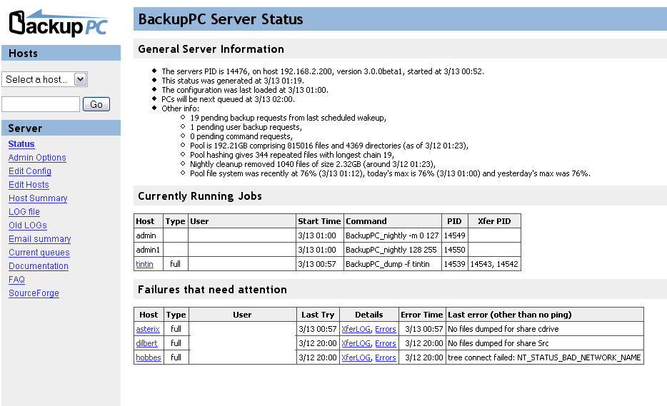
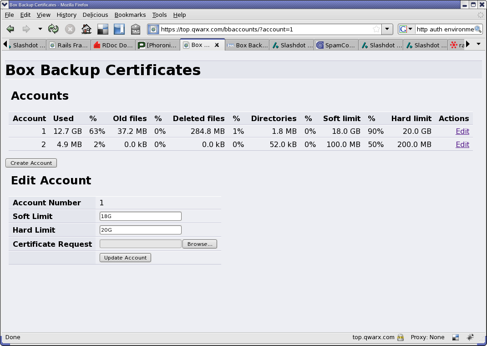
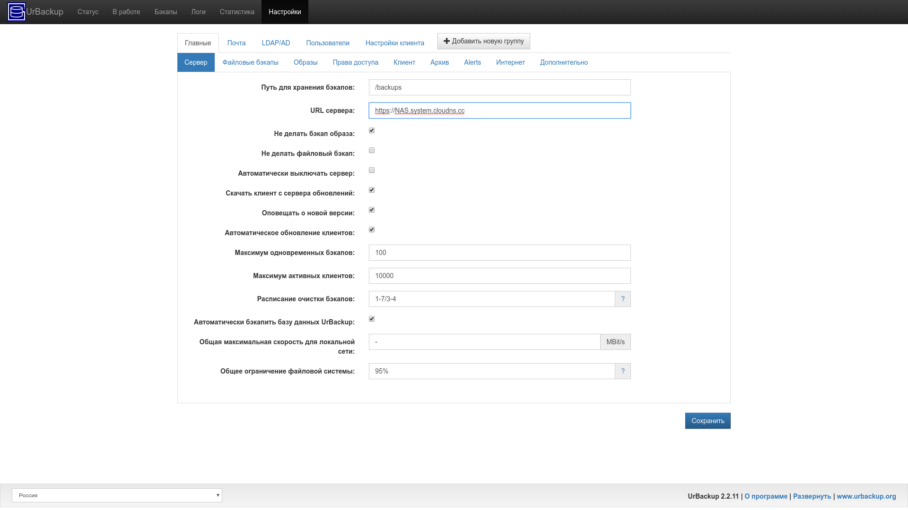
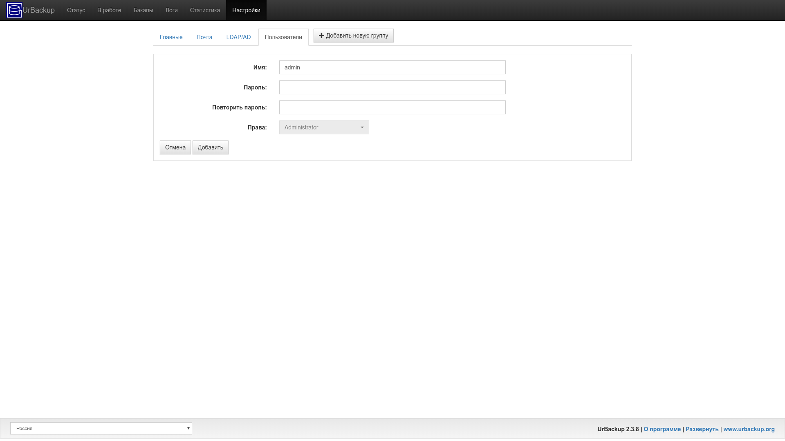
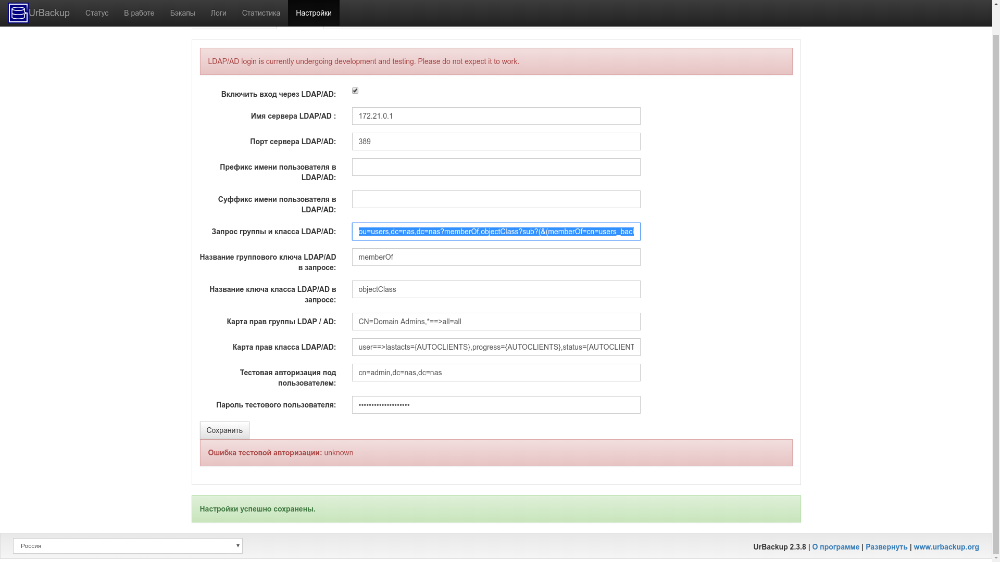
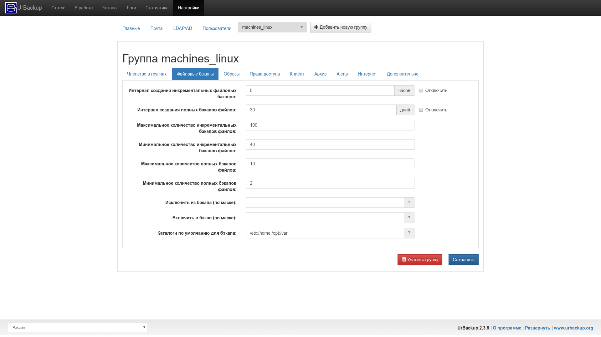
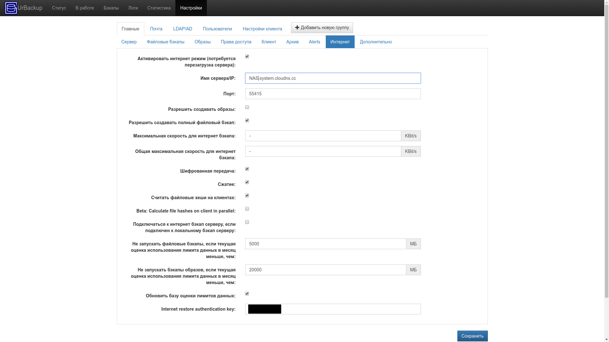

# Система резервного копирования


Эта статья - часть [цикла о построении NAS](https://habr.com/post/359346/), и написана под конкретный вид системы.

Резервное копирование - вторая основная задача, которую я хотел решить, используя NAS, после [системы управления репозиториями](https://habr.com/post/418883/).

Решение её затянулось...

Про данную тему уже написана масса статей и даже несколько книг, а в спорах об этом сломано много копий.

Ниже - попытка разобраться в этой куче материала, уложить его в голове и построить небольшую систему относительно грамотно.

<cut/>

Система резервного копирования (СРК) определяется:

- Политикой резервного копирования. Политика задаёт основные цели и задачи резервного копирования, требования к нему, исходя из списка угроз для каждой резервируемой системы, а также обосновывает его необходимость.
- Регламентом резервного копирования, определяемого политикой. Регламент описывает алгоритмы резервного копирования и восстановления, ответственных за резервное копирование, условия хранения резервных копий и прочее.
- Инструментальной реализацией. Собственно, программное и аппаратное обеспечение.

Регулярный процесс резервного копирования, делится на следующие основные части:

- Периодический запуск копирования.
- Запуск восстановления по требованию.
- Тестирование процесса копирования.

Точки сопряжения системы с платформой NAS:

- `tank0/apps/backup` - хранилище резервных копий.
- `tank1/apps/backup` - хранилище резервных копий.
- `https://backup.NAS.cloudns.cc` - Web-интерфейс системы.

Хранилища резервных копий являются **отдельными файловыми системами**.
Это нужно потому, что их опции могут сильно отличаться, как от нормальных файловых систем, так и между собой.

Например, при необходимости, могут быть включены дедупликация средствами ФС и отключено сжатие.


## Принципы резервного копирования


Стоит понимать, что хотя я описываю здесь частный случай резервного копирования, который заточен под нужды маленькой сети, принципы, наблюдения и закономерности везде общие.
В простых случаях некоторыми из них возможно пренебречь, но знать желательно.

На этих принципах строятся политика и регламент.

Вот несколько основных:

- **3-2-1**. Делайте минимум три резервные копии, в двух форматах хранения, из которых, минимум одна должна храниться в физически отдельном месте. Принцип желательно соблюдать. В моём случае, этот принцип частично выполняется. Во-первых, есть три разные машины, на которых частично продублированы данные: NAS, рабочая и ноутбук. Во-вторых, планируется репликация в облако.
- **Проверяйте, что было скопировано**. Иначе, может получиться так, что в ответственный момент, данные невозможно будет восстановить. Проверять лучше через процесс восстановления.
- **Используйте подходящие для задачи инструменты**. Вероятно, что с копированием парка виртуалок, система для копирования файлов с агентом на машине справится плохо. Специализированное ПО будет копировать быстрее и менее затратно по машинным ресурсам. Важно чтобы инструмент был надёжным и простым. СРК - не то, с чем вам обычно захочется постоянно копаться.
- **Лучше копировать всё, за явным исключением лишнего**. Или "лучше перебдеть, чем недобдеть". Выкинуть лишнее успеется, но если используется обратная политика, восстановить ценный файл, который забыли указать явно, может быть невозможно.
- **Должна быть возможность быстро выбирать и восстанавливать данные**. Желательно, "одним кликом", а не ждать час. Формально, надо иметь приемлемо низкий RTO, и достаточный RPO. Крайне удобно, если СРК позволяет восстановить случайно удалённое, причём выбрать из нескольких версий, а не только последнюю (например, если она повреждена, ведь логические ошибки не исключаются).

[В конце статьи](#literatura) есть ссылки на источники, которые вы можете изучить, чтобы полнее ознакомиться с данными пунктами, а также почитать о других.


## Политика резервного копирования

Очевидно, что цель всякого резервного копирования - понижение затрат от незапланированного уничтожения данных в нештатных ситуациях.

Достигается эта путём дублирования ценных данных с рабочих машин в сторонние хранилища.


### Задачи резервного копирования

Следующие задачи определяются из целей резервного копирования:

- Выделение целевых данных.
- Сохранение указанных данных для последующего восстановления.
- Восстановление сохранённых данных.
- Обеспечение устойчивости хранимых данных к изменению и уничтожению.
- Разграничение доступа к хранимым данным.
- Обеспечение контроля системы и процесса резервного копирования.


### Требования к системе

Далее в списке, как функциональные, так и нефункциональные требования вперемешку:

- Резервное копирование должно выполняться:
  * По расписанию.
  * По запросу.
  * При пропуске предыдущего.
- Должно быть обеспечено резервирование данных, как минимум 1 раз в сутки на глубину 1 месяц. Практика ведения снапшотов, а также использования предыдущего варианта системы на рабочей машине, показывает, что мне этого достаточно.
- Время восстановления данных не должно превышать 2 минуты на 1 GB (ограничение пропускной способности сети - 81 с. на 1 GB). Взято с учётом пропускной способности ЛВС и скорости работы дисков, как ограничивающих факторов.
- Все каналы должны быть зашифрованы. Сохранятся могут чувствительные данные, например данные авторизации в онлайн сервисах.
- Должна иметься возможность шифровать пользовательские резервные копии секретным ключом на машине пользователя, без возможности расшифровки на сервере. Это важно, потому что пользователи вовсе не обязаны доверять серверу.
- Неполное копирование не должно занимать много времени, например более 30 минут. Для копирования данных с ноутбука используется Интернет.
- Должна быть потенциальная возможность репликации копий в облако (возможность гибко настроить репликацию для конкретного облачного хранилища) с шифрованием бэкапов. Это тоже одно из следствий "принципа 3-2-1".
- Должно быть простое централизованное управление с интеграцией в web-интерфейс.
- Минимум доработок и сложной настройки на сервере.


### Состав резервируемых ресурсов

В моём случае он достаточно типичен:

- Основная рабочая машина. Стационарный компьютер.
- Мобильная рабочая машина. Ноутбук.
- Роутер ЛВС. Там хранятся настройки сети, в которых могут быть логины и пароли для Интернет-соединения и некоторых сервисов.
- NAS. Да, конфигурация NAS тоже резервируется. Несмотря на то, что на большинстве ФС ведутся снэпшоты.


### Состав угроз

Это то, где, что и от чего следует защитить и каким образом.

<spoiler title="Для этого я составил небольшую таблицу угроз.">
| Ресурс                   | Угроза                                            | Решение
|--------------------------|---------------------------------------------------|--------------
| Основная рабочая машина  | Физическое разрушение данных                      | Резервирование данных и ключевых настроек
| Основная рабочая машина  | Частичное незаметное сразу повреждение данных     | Хранение более старых резервных копий в течение некоторого времени
| Основная рабочая машина  | Утеря доступа к данным                            | Хранение полного образа машины, либо **настроек, для быстрого разворота на другой машине**, либо дублирование функций на мобильном ПК
| Основная рабочая машина  | Несанкционированный физический доступ к данным    | Шифрование данных и резервных копий, передача копий в шифрованном виде
| Основная рабочая машина  | Несанкционированный доступ путём нарушения ПО     | Резервирование контрольных сумм ПО и периодическая сверка, системы контроля (пока не реализую)
| Мобильная рабочая машина | Утеря машины вместе с данными                     | Шифрование данных, полное резервирование, либо резервирование ключевых настроек и данных
| Роутер ЛВС               | Разрушение конфигурации, либо устройства          | Резервирование конфигурации, возможно резервирование устройства
| Роутер ЛВС               | Утеря контроля вследствие взлома                  | Резервирование конфигурации
| Роутер ЛВС               | Частичное незаметное повреждение данных           | Хранение контрольных сумм ПО и периодическая сверка
| NAS                      | Повреждение настроек служб                        | Локальное резервирование настроек
| NAS                      | Физическое разрушение данных                      | Репликация в облако
| NAS                      | Потеря доступа к системе и резервным копиям       | Репликация в облако
| NAS                      | Несанкционированный доступ к данным посторонних   |Хранение и репликация данных в шифрованном виде, обмен данными в шифрованном виде
| NAS                      | Несанкционированный доступ администратора к данным|Шифрование резервных копий на локальных ключах резервируемых машин

</spoiler>

Все основные угрозы мобильному компьютеру повторяют угрозы стационарному.
Планшетные компьютеры практически не отличаются от мобильного, с этой точки зрения.


### Дополнительные условия политики

Их желательно учесть:

- Должно проводиться регулярное тестирование восстановления.
- Процедура восстановления после сбоя должна быть задокументирована.
- Должны регламентироваться действия на случай вторичного сбоя: что делать, если после восстановления система не работоспособна, либо данные невозможно восстановить.
- Нужно тестировать, зависит ли процесс восстановления от специфичной аппаратуры
  (которая может выйти из строя в момент восстановления). Это я, в моём случае, проверять не буду, ограничиваясь только базовой проверкой системы.
- При наличии полного резервного копирования системы, надо выполнять резервное копирование сразу после существенного обновления.
- Если кумулятивный объем инкрементальных резервных копий превосходит объем полной резервной копии, рационально сделать внеплановую полную резервную копию. Т.е., частота создания полных резервных копий, в таком случае должна быть повышена.

Последний пункт политики я не учитываю, потому что обычно мой рабочий процесс не меняется, и достаточно следить за объёмом некоторое время, только для первоначальной настройки.
Опытным путём было выяснено, что схема "месяц, неделя, день, час" вполне меня устраивает.
Для более крупных систем, возможно потребуется менять частоту бэкапов динамически для каждой системы.


## Регламент резервного копирования

После разработки политики возможно приступать к разработке непосредственно регламента.
В общем случае, регламентов может быть несколько: общий, для администраторов СРК, для пользователей, для ответственных за хранение, для администраторов целевых систем и т.п..
Но в случае небольшой системы это, как правило, один человек, потому и регламент один.


### Задачи регламента

- Определение процедуры резервирования данных.
- Определение процедуры восстановления данных.
- Определение процедуры проверки работоспособности системы.
- Условия хранения резервных копий и требования к носителям.
- Упорядочение работы.


### Пример регламента

Под спойлером вы можете увидеть, как выглядит регламент в крупной организации, на примере [взятого из открытых источников регламента Росреестра](https://web.archive.org/web/20160731233007/http://www.just.kopr.ru/doc/just/Reglament_for_copy.docx).

<spoiler title="Регламент Росреестра.">
# РЕГЛАМЕНТ РЕЗЕРВНОГО КОПИРОВАНИЯ ДАННЫХ В ТЕРРИТОРИАЛЬНЫХ ПОДРАЗДЕЛЕНИЯХ РОСРЕЕСТРА


## Оглавление

1. Общие положения.
2. Порядок резервного копирования.
3. Контроль результатов.
4. Нормативно-правовое обеспечение.
5. Ротация носителей резервной копии.
6. Восстановление информации из резервной копии.
7. Приложение 1.
8. Приложение 2 Перечень лиц, ответственных за резервное копирование.


## **1**  Общие положения

Настоящий Регламент устанавливает основные требования к организации резервного копирования (восстановления) программ и данных, хранящихся в базах данных на серверах территориального органа Росреестра, а также к резервированию аппаратных средств.

Настоящий Регламент разработан с целью:

- определения категории информации, подлежащей обязательному резервному копированию;
- определения процедуры резервирования данных для последующего восстановления работоспособности информационных систем при полной или частичной потере информации, вызванной сбоями или отказами аппаратного или программного обеспечения, ошибками пользователей, чрезвычайными обстоятельствами (пожаром, стихийными бедствиями и т.д.);
- определения порядка восстановления информации в случае возникновения такой необходимости;
- упорядочения работы и определения ответственности должностных лиц, связанной с резервным копированием и восстановлением информации.

Под резервным копированием информации понимается создание полных копий производственных БД Управления, для быстрого восстановления работоспособности информационной системы ведения ЕГРП АИС «Юстиция», в случае возникновения аварийной ситуации, повлекшей за собой повреждение или утрату данных.

Резервному копированию подлежат все производственные БД всех территориальных отделов Управления.

Машинным носителям информации, содержащим резервную копию, присваивается гриф конфиденциальности по наивысшему грифу содержащихся на них сведений.

Резервные копии хранятся вне пределов серверного помещения, доступ к резервным копиям ограничен. Список лиц, имеющих доступ к данным, формируется на основании письменной Заявки руководителя подразделения информационных технологий (ИТ), согласованной с руководителем подразделения информационной безопасности (ИБ). Изменение прав доступа к резервируемым техническим средствам, массивам и носителям информации производится на основании Заявки руководителя подразделения ИТ, согласованной с руководителем подразделения ИБ. О выявленных попытках несанкционированного доступа к резервируемой информации и аппаратным средствам, а также иных нарушениях ИБ, произошедших в процессе резервного копирования, сообщается в подразделение ИБ служебной запиской в течение рабочего дня после обнаружения указанного события.


## **2** Порядок резервного копирования

Резервное копирование производится штатными средствами СУБД Oracle. Резервное копирование может производится:

- Вручную – оператор, ответственный за резервное копирование запускает процедуру экспорта Oracle (пример запуска процедуры в Приложении 1).
- Автоматически – запуск исполняемого файла, производящего вызов процедуры экспорта Oracle, производится операционной системой по расписанию автоматически.

Резервное копирование БД производится не реже 1 раза в сутки. Срок хранения резервной копии БД не менее 1 месяца.

Стратегия резервного копирования должна гарантировать синхронное восстановление данных, расположенных в разных схемах БД. Например, схема ХЭД (хранилище электронных документов), должна копироваться одновременно со схемой АИС Юстиция.

Материально-технические средства системы резервного копирования должны обеспечивать производительность, достаточную для сохранения информации, в установленные сроки и с заданной периодичностью. Лица, ответственные за организацию резервного копирования, ежедневно осуществляют контроль за наличием необходимого для резервного копирования объема дискового пространства.


## **3** Контроль результатов

Контроль результатов всех процедур резервного копирования осуществляется ответственными должностными лицами, указанными в Приложении 2, в срок до 10 часов рабочего дня, следующего за установленной датой выполнения этих процедур.

В случае обнаружения ошибки лицо, ответственное за контроль результатов, сообщает о ней в службу технической поддержки разработчика не позднее 11 часов текущего рабочего дня.


## **4** Нормативно-правовое обеспечение

Для организации процесса резервного копирования необходимо:

- Определить список лиц, ответственных за выполнение процесса резервного копирования и контроля его результатов (Приложение 2).
- Подготовить и утвердить график выполнения резервного копирования.
- Подготовить и утвердить внутренние распорядительные документы о назначении ответственных за резервное копирование данных.


## **5** Ротация носителей резервной копии

Система резервного копирования должна обеспечивать возможность периодической замены (выгрузки) резервных носителей без потерь информации на них, а также обеспечивать восстановление текущей информации автоматизированных систем в случае отказа любого из устройств резервного копирования. Все процедуры по загрузке, выгрузке носителей из системы резервного копирования, а также перемещение их в Службу безопасности и обратно, осуществляются администратором резервного копирования по запросу и в присутствии ответственного сотрудника Службы безопасности Заказчика (согласно Приложению №2).

В качестве новых носителей допускается повторно использовать те, у которых срок хранения содержащейся информации истек.

Конфиденциальная информация с носителей, которые перестают использоваться в системе резервного копирования, должна стираться с использованием программного обеспечения PGP.


## **6** Восстановление информации из резервной копии

В случае необходимости восстановление данных из резервных копий производится ответственным работником подразделения ИТ, указанным в Приложении N 2.

Восстановление данных из резервных копий происходит в случае ее исчезновения или нарушения вследствие несанкционированного доступа в систему, воздействия вирусов, программных ошибок, ошибок работников и аппаратных сбоев.

Восстановление системного программного обеспечения и программного обеспечения общего назначения производится с их носителей в соответствии с инструкциями производителя.

Восстановление специализированного программного обеспечения производится с дистрибутивных носителей или их резервных копий в соответствии с инструкциями по установке или восстановлению данного программного обеспечения.

Восстановление информации, не относящейся к постоянно изменяемым базам данных, производится с резервных носителей. При этом используется последняя копия информации.

При частичном нарушении или исчезновении записей баз данных восстановление производится с последней ненарушенной ежедневной копии. Полностью информация восстанавливается с последней копии.


## **7** Приложение 1

Пример запуска утилиты экспорта Oracle из командной строки:

exp userid=JUST\_USER/PASSWORD@SERVER owner=(JUST\_USER,HED\_USER) direct=Y consistent=Y statistics=NONE compress=N file=C:\BACKUP.DMP log=C:\BACKUP.LOG

где:

JUST\_USER/PASSWORD@SERVER _–_ имя\_владельца\_схемы/пароль@имя\_сервера;

owner=(JUST\_USER,HED\_USER) – перечень копируемых схем, в данном примере одновременно экспортируются схема АИС Юстиция и схема ХЭД;

file=C:\BACKUP.DMP _–_ путь и имя создаваемого файла экспорта;

log=C:\BACKUP.LOG _–_ путь и имя создаваемого файла лога экспорта.


## **8** Приложение 2. Перечень лиц, ответственных за резервное копирование

| **№ п/п** | **Выполняемая роль** | **ФИО ответственного сотрудника** |
| --- | --- | --- |
| 1 | Первоначальная настройка системы резервного копирования. |   |
| 2 | Внесение существенных изменений в настройку системы резервного копирования. |   |
| 3 | Анализ логов резервного копирования, отслеживание необходимости изменений настроек резервного копирования, обеспечение ротации носителей. |   |
| 4 | Ротация носителей, проверка корректности резервной копии, обеспечения хранения резервной копии вне офиса на случай катастрофы. |   |
</spoiler>

[Здесь](https://netolkoit.ru/reglament-rezervnogo-kopirovaniya-razbor-sostavlyayushhih/) вы найдёте ещё один пример с небольшим описанием.


### Процедура резервирования

Состав резервируемых данных:

- Рабочие машины:
  * Личные каталоги пользователей (`/home/*`). Пользователи явно могут выключать часть данных из процесса копирования.
  * Общие каталоги пользователей.
  * ПО не из репозиториев, по возможности (`/opt`).
  * Настройки узла (`/etc`).
  * Состав установленных пакетов узла.
  * Базы данных.
  * Заголовки шифрованных разделов.
  * Каталоги виртуальных машин.
- Роутеры:
  - Настройки роутера.
- NAS:
  * Каталоги и тома Docker контейнеров.
  * Общие каталоги пользователей.
  * Настройки узла.
  * Состав установленных пакетов узла.
  * Базы данных.
  * Файлы описания и настройки Docker контейнеров.
  * Заголовки шифрованных разделов.
  * Полные резервные копии машин.
- Планшетные компьютеры:
  - Резервирование данных не требуется.

Способ резервирования:

- Каталоги рабочих машин резервируются через агент системы.
- Специфичные настройки резервируются через агент, с использованием команд ОС.
- Резервироание после обновления выполняется запуском агента через скрипт в `/etc/apt/apt.conf.d`, либо способом, который специфичен для резервируемой системы.
- Роутеры резервируются по [рекомендациям Mikrotik](https://wiki.mikrotik.com/wiki/Automated_Backups).
- NAS также резервируется через агент.

Частота резервирования:

- Полная резервная копия делается 1 раз в месяц для всех машин. Копия производится первого числа месяца.
  Хранится 3 месяца.
- Декрементальная резервная копия делается 1 раз в неделю в субботу.
  Хранится месяц.
- Инкрементальная резервная копия делается 1 раз в день.
  Хранится месяц.
- Перед обновлением системы создаётся инкрементальная резервная копия.
  Хранится месяц.
- В конце месяца производится репликация полных копий в облачное хранилище.
  Копии хранятся минимум 6 месяцев, и удаляются по мере заполнения хранилища.


### Процедура восстановления


- Для пользовательских данных производится имеющим доступ к СРК, по запросу.
- Для пользовательских данных выполняется штатными средствами ПО, которое осуществляет резервное копирование.

Общая процедура восстановления после сбоя для рабочих машин:

- Загрузиться с live системы.
- Перенести настройки и состояние пакетов из резервной копии.
- Если после восстановления система неработоспособна, переустановить систему.

Следует заметить, что до третьего пункта я ни разу за время использования Debian не доходил (начиная со Squeeze от 2011 года), и подобная ситуация у меня была лишь когда я использовал Slackware на ReiserFS более десяти лет назад.

Общая процедура восстановления после сбоя для роутера:

- В случае неработоспособного роутера, сбросить его.
- Восстановить настройки из резервной копии через импорт.
- Если роутер неработоспособен, заменить железо на аналогичное.
- Восстановить настройки из резервной копии через импорт.

Mikrotik вполне меня устраивает, а настройки в RouterOS совместимы.


### Процедура проверки работоспособности

- Производится постоянный контроль журналов системы резервного копирования.
  Реализуется посредством logcheck, [уже описанным ранее](https://habr.com/ru/post/421279/).
- Раз в месяц производится частичный контроль работоспособности из резервной копии.

Предлагается использовать для проверки работоспособности виртуальную машину, запущенную на стационарном компьютере.


### Условия хранения резервных копий и требования к носителям

- Резервные копии хранятся на работающей системе.
- С периодом в 1 месяц производится репликация резервных копий в облачное хранилище.
  Репликация производится в ночное время с целью понижения загруженности канала в процессе его использования.
- Носители зашифрованы. Полнодисковое шифрование обеспечивается поддерживающей системой.
- Резервные копии шифруются СРК.


## Решения для резервного копирования

Пришло время рассмотреть программное обеспечение, которое может быть использовано для резервного копирования.


### Требования к ПО

При выборе я руководствовался следующими требованиями:

- Проприетарные закрытые решения типа [Veeam](https://www.veeam.com/ru) может быть хороши и продуманы, но не рассматриваются, по условиям политики безопасности. А некоторые из подобных решений, такие как продукты Acronis, вообще никуда не годны, если [судить](http://www.softportal.com/response-1689-acronis-true-image-1.html) по [мнению](https://thegrumpyitguy.wordpress.com/2013/07/09/i-fucking-hate-acronis-just-as-much-as-backup-exec/) недовольных [пользователей](https://ru-sysadmins.livejournal.com/2040268.html).
- Должна быть предусмотрена возможность для пользователей исключать часть дерева каталогов из процесса резервирования.
- Должна быть предусмотрена возможность восстановления из резервной копии средствами ПО.


### Выбор ПО

Под спойлером ниже рассмотрены несколько возможных систем для резервного копирования.
Ещё больше вы можете найти [здесь](https://github.com/jturgasen/my-links#backups), и [здесь](https://tproger.ru/digest/sysadmin-compilation/#1).

<spoiler title="Несколько вариантов систем.">
### Решения на базе unix-утилит

[Решения на основе rsync, tar, rdiff-backup, etc.](http://www.mikerubel.org/computers/rsync_snapshots/) не рассматриваются по причине большого количества работы, которую потребуется выполнить, и отсутствия необходимого WEB-интерфейса.


### [Bareos](https://www.bareos.org/en/)

[](images/kppa7tts84fep2t5rfk52poagx4.png)

BareOS (Backup Archiving Recovery Open Sourced) - форк Bacula с 2010 года.

Плюсы:

- Стабильная отлаженная система.
- Поддерживает несколько типов агентов под разные ОС.
- Поддерживает различные типы бэкапа: инкрементальный, дифференциальный, полный.
- WEB-интерфейс очень развит и функционален.
- Гибкая конфигурация.
- Имеется FUSE драйвер, который показывает бэкапы.
- Есть обвязка для Python, позволяющая взаимодействовать с Director.
- Есть агенты для бэкапа специфичных приложений (например, СУБД).
- Все коммуникации между различными компонентами системы аутентифицируются.
- Поддержка большого количества систем хранения.

Минусы:

- Ориентация на ленточный бэкап.
- Многокомпонентная запутанная система.
- Сложная и запутанная конфигурация.
- Требует постоянной поддержки, в случае минимальных изменений.
- Документация обширная (500+ страниц), но несмотря на это, настройка под типовой вариант использования сложна и занимает много времени.


### [BackupPC](http://backuppc.sourceforge.net)

[](images/zidve44-5zrteeqdkiosyigkvwu.png)

Безагентная система резервного копирования.

Плюсы и возможности:

- Возможен бэкап без агентов.
- Полные и инкрементальные бэкапы.
- Есть Web-интерфейс.
- Минимизирует количество дисковых операций.
- Дедупликация. Одинаковые файлы сохраняются однократно, даже если это файлы на разных машинах.
- Возможность сжатия данных.
- Не нужен клиент, могут использоваться SMB, rsync.
- Возможность восстановления файлов прямо через Web-интерфейс.
- Возможно восстановить как конкретные файлы, так и скачать все файлы архивом.
- Гибкая конфигурация, как системная, так и отдельная для каждой машины.
- Возможность посылать уведомления.

Минусы:

- Реализован на Perl, требует установки CPAN.
- Безагентный бэкап менее гибок, чем бэкап через агента, хотя и возможно более безопасен.
  Для бэкапа не требуется запускать агент на машине, а все данные, которые требуется сохранить, возможно перекладывать в один каталог. С другой стороны, если система будет заходить на пользовательскую машину по SSH и забирать всё, что нужно сама, этот вариант менее безопасен, т.к. ключи будут храниться в одном месте.
- Нельзя выбрать время начала копирования (компенсируется выбором периодов, когда делать копирование запрещено).


### [UrBackup](https://www.urbackup.org)

[](images/u1loed_wq1-njxjlq1f7ths2kso.png)

Клиент-серверная система резервного копирования с агентом.

Плюсы и возможности:

- Простая настройка.
- Есть Web-интерфейс.
- Полные и инкрементальные бэкапы.
- Файловые бэкапы и бэкапы разделов (в т.ч. инкрементальные).
- Клиенты для Windows, Linux, MacOS X.
- Быстрая дедупликация на клиенте: быстро вычисляются изменения в дереве, и передаются только новые файлы или сектора диска.
- Бэкап разделов при запущенной системе.
- Возможность бэкапа каталогов при изменении.
- Корректные бэкапы используемых приложениями файлов (например, баз Outlook, клиент знает о распространённых приложениях).
- Дедупликация на сервере. Одинаковые файлы сохраняются однократно, даже если это файлы на разных машинах.
- Настройки бэкапов (частоту, количество и т.п.) клиент может менять для себя.
- Простая настройка.
- Предупреждение клиента о том, что бэкап не был сделан.
- Возможно восстановить как конкретные файлы, так и скачать все файлы архивом.
- Возможность посылать уведомления.
- Безопасные и эффективные бэкапы через Internet.
- Метаданные файлов (например, время изменения) сохраняются.
- Поддержка квот на размер бэкапов.
- Простое восстановление бэкапа раздела (например, через подключенную USB флешку).
- Автоматическое обновление.
- Есть GUI для агента на машине пользователя.

Минусы:

- Клиент под Windows, способный отслеживать изменения блоков, платный.
- Бэкап разделов работает только с NTFS.
- Поддержка LDAP, хотя и заявлена, реализована плохо, ориентируется на AD и явно не соответствует релизному уровню.


### [Restic](https://restic.net/)

Инструмент для резервного копирования и восстановления с консольным интерфейсом.

Плюсы и возможности:

- Простая настройка.
- Использует шифрование для шифрования резервных копий.
- Дедупликация. Одинаковые файлы сохраняются однократно, даже если это файлы на разных машинах.
- Нет понятия полного/инкрементального бэкапа. Все они равноценные. Передаются только новые блоки.
- Все данные и метаданные защищены контрольными суммами. Возможность проверки корректности бэкапа.
- Сервера бэкапа нет.
- Имеется FUSE драйвер, который показывает бэкапы в виде иерархии host/дата.

Минусы:

- Web-интерфейса нет.
- Относительно требователен к RAM (~2.7GB на 1TB).
- Не сохраняет ACL и расширенные атрибуты.
- Медленное и требовательное к RAM удаление ненужных бэкапов.
- Удаление ненужных бэкапов блокирует работу (производить бэкап в это время невозможно).
- Ключи шифрования одни на все хосты (в общем случае любой хост может прочитать все бэкапы). Проблема может быть решена.
- Медленное восстановление с помощью стандартного интерфейса restic.


### [BorgBackup](https://www.borgbackup.org/)

[](images/a_qprhceevkysy_nk_xg20os5x0.jpeg)

Дедуплицирующая программа для резервного копирования.

Плюсы и возможности:

- Серверной части нет.
- Эффективное использование дискового пространства для хранения резервных копий.
- Достаточно высокопроизводителен (основной код на Python, но критичные участки реализованы на C и оптимизированы).
- Шифрование.
- Сжатие: LZ4, zlib, LZMA.
- Имеется FUSE драйвер, который показывает бэкапы.
- Простая установка на различные платформы: Linux, macOS, BSD, etc.
- [Есть Web-интерфейс, как отдельный проект](https://borgweb.readthedocs.io/en/latest/).
- Поддерживается большим сообществом разработчиков.

Минусы:

- Web-интерфейс достаточно ограниченный.
- Нет прямой поддержки ОС Windows (только через Linux subsystem или cygwin).


### [Lsyncd](https://github.com/axkibe/lsyncd)

Демон, выполняющий резервирование изменяемых файлов через rsync.

Плюсы и возможности:

- Использует inotify или fsevents для наблюдения за каталогом. После истечения времени вызывает rsync для копирования изменений.
- Может использовать не только rsync.
- Реализован на Lua, конфиг процедурный тоже на Lua.
- Почти не снижает производительной локальной ФС.
- Гибко настраивается.

Минусы:

- Легковесная система. Не имеет Web-интерфейса и централизованной настройки.


### [Box Backup](https://www.boxbackup.org/)

[](images/4eo-taslxisuzzofmwhmmjtjxmk.png)

Автоматическая онлайновая система с открытым исходным кодом.
Вот [более подробное описание](https://habrahabr.ru/post/8156/).

Плюсы и возможности:

- Данные шифруются на клиенте и на сервере хранятся в зашифрованном виде и могут быть расшифрованы только клиентом, имеющим ключ.
- Трафик шифруется, используя TLS, авторизация как клиентов, так и сервера по SSL сертификатам.
- Возможен не только онлайновый, но и "традиционный" бэкап, при котором создаются снэпшоты.
- На сервер отправляются только изменённые файлы.
- Поведение, как у ленты: доступны и новые, и удалённые файлы.
- На сервере сохраняются только изменения файлов, а не полная копия.
- Используется сжатие.
- Может быть настроен оптимальный режим резервирования: для документов или для сервера.
- Возможность обеспечения избыточности без использования RAID.
- Поддержка \*nix-like систем, Windows native, Windows cygwin.
- Есть локальный GUI.

Минусы:

- Данные хранятся в виде файлов, имена которых являются UID. В случае утери ключа или повреждения системы, восстановить данные будет сложно.
- Отсутствует Web-интерфейс.

</spoiler>

Изо всех решений я выбрал [UrBackup](https://www.urbackup.org/download.html).
Про его настройку возможно [почитать в документации](https://www.urbackup.org/administration_manual.html#x1-360007) или, например [здесь](https://habr.com/post/262499/).

Я не буду повторяться и далее покажу лишь несколько специфичных моментов.


### Настройка сервера UrBackup

Если файловая система под бэкапы ещё не создана, её надо создать:

```
# zfs create -o com.sun:auto-snapshot=false -p tank0/apps/backup
# zfs set compression=on tank0/apps/backup
```

Снэпшоты не требуются, а вот сжатие лучше включить, следуя [части руководства UrBackup про ZFS бэкэнд](https://www.urbackup.org/administration_manual.html#x1-10700011.6.4).

На своё усмотрение, при наличии достаточного количества памяти возможно подключить дедупликацию на данной файловой системе:

```
# zfs set dedup=on tank0/apps/backup
```

Теперь возможно поднять сервер UrBackup в контейнере:

```
# mkdir /tank0/docker/services/urbackup
# cd /tank0/docker/services/urbackup
# vim docker-compose.yml
# docker-compose up -d
```

Конфигурационный файл docker-compose приведён ниже.
Дальнейшая настройка производится из Web-интерфейса сервера и подробно описана в [Руководстве администратора](https://www.urbackup.org/administration_manual.html).

<spoiler title="docker-compose.yml">
```yaml
version: '2'

networks:
  docker0:
    external:
      name: docker0

services:
  urbackup: uroni/urbackup-server
    image: 
    restart: always
    expose:
      - 55414
    ports:
     # - 55413:55413
      - 55415:55415
      - 35623:35623/udp
    volumes:
      - /tank0/apps/backup/urbackup/database:/var/urbackup
      - /tank0/apps/backup/urbackup/backups:/backups
      - /tank0/apps/backup/urbackup/log:/var/log
      - /etc/localtime:/etc/localtime:ro
    networks:
      - docker0
    environment:
    - VIRTUAL_HOST=backup.*
    - VIRTUAL_PORT=55414
    - VIRTUAL_PROTO=http
    - CERT_NAME=NAS.cloudns.cc
    - TZ=Europe/Moscow
```
</spoiler>

Официальный Docker образ `uroni/urbackup-server` редко обновляется, и помимо него есть образ `tristanteu/urbackup-docker`.
Но он у меня не заработал нормально.

Следующее, что требуется сделать после запуска сервера:

1. Добавить администратора. Администратор должен иметь возможность зайти в случае обрыва связи между UrBackup и LDAP сервером.
2. Настроить интеграцию с LDAP. С LDAP всё плохо. Он "поддерживается в экспериментальном режиме". Проще говоря, на данный момент он не работает.
3. Настроить почтовые оповещения.
4. Создать группы агентов и настроить их расписание, согласно регламенту. Делается в интерфейсе. Пример есть на скриншоте ниже. Кроме того, если часть пользовательских данных хранится в NAS, их стоит убрать из бэкапа.
5. Активировать Интернет-режим.

Основные настройки сервера:

[](images/03xx3dgvb6xtswdsfejbdakwwkg.png)

Добавление администратора:

[](images/um0u1h_i9ikrjhpgt-ppfyjubzs.png)

LDAP настроить мне не удалось, но это не особенно критично: сервер имеет только одного администратора, сами же агенты имеют доступ только к своим данным.

Запрос группы и класса был следующий:

```bash
ou=users,dc=nas,dc=nas?memberOf,objectClass?sub?(&(memberOf=cn=users_backup,ou=groups,dc=nas,dc=nas)(uid={USERNAME}))
```

Если у кого-то получится, жду рекомендаций в комментариях.

[](images/azwb0qxoafmccqrzs1iyrchpi2q.png)

В системе есть одна группа, в которой содержатся настройки по умолчанию, и куда попадают все созданные вновь клиенты.
Но я бы рекомендовал добавить отдельные группы, чтобы проще было манипулировать настройками:

[](images/xicxvnphcifc4z8ocwwrem8hqei.png)

Включение Интернет-режима:

[](images/spvkuc8fxj9-vxldm4k9qmb7c6o.png)

Обратите внимание, что тут задаётся имя сервера, которое будет прописано в архиве с преднастроенным агентом.

Порты, используемые UrBackup:

- Порт TCP 55415 - бэкап по Интернет.
- Порт TCP 55414 - Web-интерфейс по HTTP.
- Порт TCP 55413 - Web-интерфейс по FastCGI, что может быть полезно для интеграции с Web-сервером. Т.к. обратный прокси в NAS использует HTTP/HTTPS, этот вариант не требуется.
- Порт TCP 35621 - на этот порт клиент принимает запросы от сервера на получение файлов.
- Порт UDP 35622 - на этом порту слушает процесс ядра клиента. Сервер будет передавать на этот порт широковещательные запросы. Клиент отправит в ответ имя машины.
- Порт TCP 35623 - на этот порт ядро клиента принимает команды от процесса интерфейса клиента и от сервера.
- Порт UDP 35623 - широковещательные запросы от сервера.

Соответственно, порт 55415 нужно пробросить на роутере, а порты 35621, 35622, 35623 отобразить на соответствующие порты хоста и разрешить в брандмауэре.


### Установка агента

Надо поставить агент на каждом из защищаемых устройств и убедиться в том, что он появился в интерфейсе сервера.

Есть несколько вариантов поставки агента:

- Самый простой вариант, [через консоль](https://www.urbackup.org/download.html#linux_all_binary) из shell архива.
- [Вариант с GUI](https://www.urbackup.org/client_debian_ubuntu_install.html), для которого требуется сборка.
- [Docker-контейнер](https://hub.docker.com/r/hejare/urbackup-client/).

Агент в UrBackup преднастроенный, т.е. скачивать его надо с вашего сервера, и доступен он будет доступен на странице вашего сервера после добавления клиента:

[](images/-ke3k4w2aornwpmehottv2shgxk.png)

Именно отсюда его и надо качать.

Вот пример установки из shell архива:

```bash
TF=`mktemp` && wget "https://NAS.system.cloudns.cc/x?a=download_client&lang=ru&clientid=1&authkey=KEY&os=linux" -O $TF && sh $TF; rm $TF
```

После установки и запуска агент должен выдать нечто подобное:

```bash
~# urbackupclientctl status             
{
"capability_bits": 65548,
"finished_processes": [],
"internet_connected": true,
"internet_status": "connected",
"last_backup_time": 0,
"running_processes": [],
"servers": [],
"time_since_last_lan_connection": 152446032
}
```

В настройках для NAS клиента надо выставить отдельные параметры, задав следующие каталоги:

- Для бэкапа: `/etc;/home;/var;/root;/tank0/apps;/tank0/docker`.
- Исключить: `/tank0/apps/backup;/tank1/apps/backup;/tank0/apps/cloud/nextcloud/html/data`.

Возможно ещё делать бэкап некоторых пользовательских данных, но это сомнительно, учитывая то, что они и так, по факту, многократно зарезервированы в текущей архитектуре.

После того, как всё готово и установлено, выбрав пункт, "Полный файловый бэкап", будет видно, что индексирование пошло:

[](images/qrnptsrut7fv4rumu7rde8fwypm.png)

На клиенте оно должно выглядеть примерно так:

```bash
~# service urbackupclientbackend status
● urbackupclientbackend.service - UrBackup Client backend
   Loaded: loaded (/lib/systemd/system/urbackupclientbackend.service; enabled; vendor preset: enabled)
   Active: active (running) since Mon 2019-09-30 21:55:53 MSK; 37min ago
 Main PID: 1694 (urbackupclientb)
    Tasks: 14 (limit: 4915)
   Memory: 13.4G
   CGroup: /system.slice/urbackupclientbackend.service
           └─1694 /usr/local/sbin/urbackupclientbackend --config /etc/default/urbackupclient --no-consoletime

сен 30 22:33:48 host urbackupclientbackend[1694]: Hashing file "/home/artiom/Docs/Books/Алиса в стране чудес.djvu"
сен 30 22:33:48 host urbackupclientbackend[1694]: Hashing file "/home/artiom/Docs/Books/Война и мир.doc"
сен 30 22:33:48 host urbackupclientbackend[1694]: Hashing file "/home/artiom/Docs/Books/Мум-му.fb2"
```


### Проблемы

К сожалению, UrBackup не так просто настраивается и легко запускается, как хотелось бы. В процессе настройки возникали проблемы.
Одна из них - проблема с отключенным Интернет-режимом, либо отсутствие заданного сервера.

<spoiler title="Статус может выводить примерно следующее...">
```bash
~# service urbackupclientbackend status
● urbackupclientbackend.service - UrBackup Client backend
   Loaded: loaded (/lib/systemd/system/urbackupclientbackend.service; enabled; vendor preset: enabled)
   Active: active (running) since Mon 2019-09-30 20:36:54 MSK; 9s ago
 Main PID: 27034 (urbackupclientb)
    Tasks: 10 (limit: 4915)
   Memory: 6.1M
   CGroup: /system.slice/urbackupclientbackend.service
           └─27034 /usr/local/sbin/urbackupclientbackend --config /etc/default/urbackupclient --no-consoletime

сен 30 20:36:54 host urbackupclientbackend[27034]: urbackupserver: Server started up successfully!
сен 30 20:36:54 host urbackupclientbackend[27034]: FileSrv: Server started up successfully
сен 30 20:36:54 host urbackupclientbackend[27034]: Started UrBackupClient Backend...
сен 30 20:36:55 host urbackupclientbackend[27034]: Looking for old Sessions... 2 sessions
сен 30 20:36:56 host urbackupclientbackend[27034]: Trying to connect to internet server "NAS.system.cloudns.cc" at port 55415
сен 30 20:36:56 host urbackupclientbackend[27034]: Successfully connected.
сен 30 20:36:56 host urbackupclientbackend[27034]: ERROR: Internet server auth failed. Error: Auth failed (Authkey/password wrong)
сен 30 20:36:56 host urbackupclientbackend[27034]: InternetClient: Had an auth error
сен 30 20:36:56 host urbackupclientbackend[27034]: ERROR: Internet server auth failed. Error: Auth failed (Authkey/password wrong)
сен 30 20:36:56 host urbackupclientbackend[27034]: InternetClient: Had an auth error
```
</spoiler>

Также может появляться следующая ошибка:

```bash
ERROR: Internet mode not enabled. Please set "internet_mode_enabled" to "true".
```

Решается большинство проблем корректной установкой настроек сервера и переустановкой клиента на заново скачанный.

Перед этим желательно остановить агент и удалить настройки:

```bash
~# service urbackupclientbackend stop
~# rm -rf /usr/local/var/urbackup/
```

Пользовательская конфигурация демона содержится в `/etc/default/urbackupclient`, но в ней минимум настроек.

В случае проблем гораздо полезнее обратить внимание системную конфигурацию агента, которая находится в файле `/usr/local/var/urbackup/data/settings.cfg`.

Сразу после того, как агент был установлен, правильная конфигурация выглядит подобным образом:

```ini
internet_server=NAS.system.cloudns.cc
internet_server_port=55415
internet_authkey=44аR3MUIdB
computername=zenbook
internet_mode_enabled=true
```

Проверьте совпадение ключей, наличие имени сервера, а также флаг включения Интернет-режима.
После того, как агент будет успешно подключен, конфигурация автоматически изменится, изменять вручную её более не следует.


### Запуск полного резервного копирования после обновления

В Debian, как я уже писал, это решается следующим простым хуком в `/etc/apt/apt.conf.d/80full-backup`:

```python
DPkg::Post-Invoke {"test -x /usr/local/bin/urbackupclientctl && /usr/local/bin/urbackupclientctl start -f  || true"; };
```


### Резервная копия роутера

К статьям о NAS, это уже не относится. Лишь замечу, что резервное копирование может быть выполнено через утилиту [mtbackup](https://github.com/yaplik/mtbackup) по SSH, которая запускается на NAS.
Небольшая обвязка на Python может заниматься ротацией бэкапов, а сам каталог, в который они сохраняются, резервироваться штатно через UrBakup, либо в облако.


### Проверка восстановления

Есть два варианта:

- Ручной.
- Автоматический.

Последний, в данный момент не сделан: я пока обкатываю работу бэкапа и убираю оттуда лишнее. Так что, это задача на будущее.

Принципиально он является скриптом, который делает следующее:

- Поднимает виртуалку или контейнер.
- Генерирует внутри набор файлов, запоминает их хэши.
- Выполняет резервирование данных файлов.
- Удаляет их, с проверкой того, что файлы удалились.
- Восстанавливает файлы через СРК.
- Выполняет сверку хэшей.
- В случае несовпадения, сигнализирует об этом.

Задача достаточно тривиальная, но если кому-то интересно, могу потом к ней вернуться.


## Облачные сервисы для резервирования


Статья про резервное копирование получилась достаточно объёмной.
А как мне видно из практики, объёмные и подробные статьи тут мало кому интересны, да и усилия от публикации на Хабре себя не оправдывают.
Поэтому о репликации в облако я как-нибудь напишу отдельно, а пока могу лишь заметить, что в качестве облачного хранилища достаточно интересно [Storj](https://storj.io/).


## Литература

Подробнее о принципах и рекомендациях, которые возможно применить в процессе разработки системы, возможно почитать в следующих источниках:

- [Обсуждение в рассылка в debian-russian](https://lists.debian.org/debian-russian/2018/03/threads.html#00059). Снимает некоторые вопросы, типа "Почему не rsync?".
- ["Разрушение мифов"](https://habr.com/ru/company/psb/blog/446054/).
- "Правило 3-2-1" [в блоге Veeam](https://habr.com/company/veeam/blog/188544/).
- [Набор правил и рекомендаций](https://habr.com/company/veeam/blog/176927/).
- У КРОКа, фактически, [описана часть политики](https://habr.com/company/croc/blog/230153/), выведенная на горьком опыте.
- [Ещё рекомендации от Veeam](https://habr.com/company/veeam/blog/163405/).
- В ["Положении о системе резервного копирования"](https://web.archive.org/web/20181201152034/http://securitypolicy.ru/%D1%88%D0%B0%D0%B1%D0%BB%D0%BE%D0%BD%D1%8B/%D0%B1%D0%B5%D0%BA%D0%B0%D0%BF) есть пример, как политики, так и регламента.
- Некоторые базовые вещи описаны в статье ["Минимизация рисков: как не потерять ваши данные"](https://1cloud.ru/blog/minimizazia-it-riskov).
- [Цикл статей о резервном копировании](https://habr.com/ru/company/southbridge/blog/449282/), в котором делается упор на достаточно подробное тестирование различных инструментов.
- [Один из примеров реализации СРК](https://habr.com/ru/company/itsumma/blog/336754/).

Также, в книгах и больших работах:

- [W. Curtis Preston - "Backup & Recovery" - 2000](http://shop.oreilly.com/product/9780596102463.do).
- [Казаков В.Г. - Технологии и алгоритмы резервного копирования](http://www.ict.edu.ru/ft/005653/62330e1-st17.pdf).
- [Берман Дж. - Backup для "чайников" - 2014](http://2015.russianinternetforum.ru/upload/acronis-book.pdf).
- [Steven Nelson - Pro Data Backup and Recovery - 2011](https://www.amazon.com/Data-Backup-Recovery-Steven-Nelson/dp/1430226625).
- [Dorian Cougias - The Backup Book: Disaster Recovery from Desktop to Data Center, 3 edition - 2003](https://www.amazon.com/Backup-Book-Disaster-Recovery-Desktop/dp/0972903909).
- [Тут](https://solutionsreview.com/backup-disaster-recovery/top-books-on-backup-and-disaster-recovery-for-2017/) есть большой и относительно свежий (2017 года) список книг.

В большинстве книг описаны серьёзные инфраструктуры.

Следует читать и применять изложенное в них, если вам нужно или очень хочется посчитать и обосновать RTO, RPA, RPO. Впрочем, если вы это делаете, скорее всего вы и так занимаетесь резервированием крупных систем, и моя статья для вас бесполезна.

Кое-что вы можете также найти в [разделе литературы о NAS](https://habr.com/ru/post/418091/), который, правда, давно не обновлялся.
